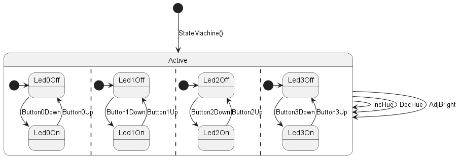
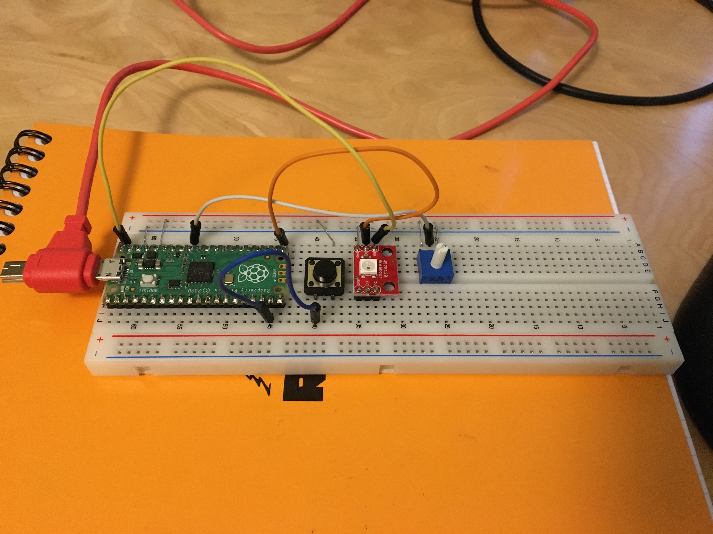
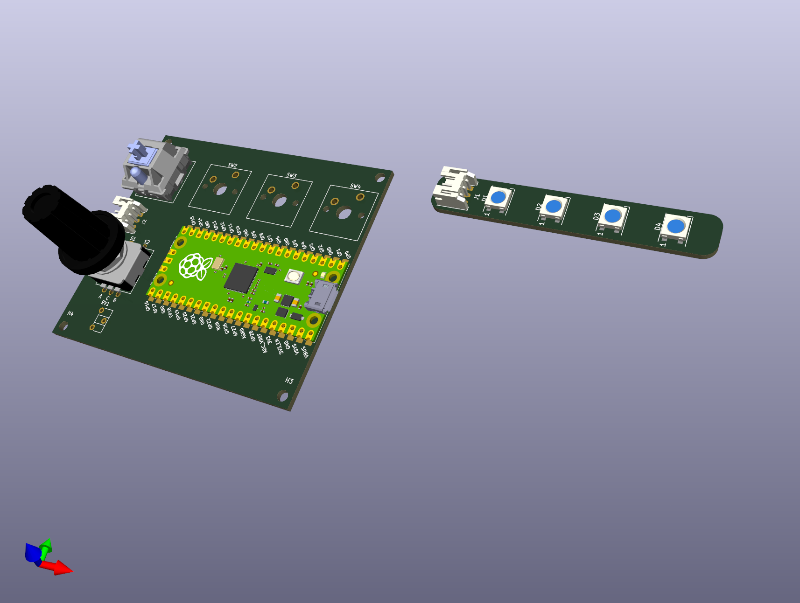

# Prismatic Spray 🌈

Designing a handheld RGB widget for light painting.
Named after the D&D spell by the same name.

<figure>
  
  <figcaption>A wizard casting the Prismatic Spray spell</figcaption>
</figure>

## Statechart

This [statechart](https://statecharts.dev/) gives an overview of the operation of Prismatic Spray:

When turned on, the device immediately transitions to the active state.
Conceptually, this initial transition can be seen as when the initialization code runs in the `StateMachine()` constructor.

In the Active state each of the concurrent sub-states for the 4 buttons are initially set
to "Led(N)Off". When a button is pressed down, the corresponding LED will illuminate until the button is released.
Pressing a button also has the side effect of setting the _focused_ LED.
This is the LED for which adjustments of the Hue knob or the Brightness knob will subsequently affect.
Only one LED can be focused like this and it will always be the last button pressed.
If no buttons have been pressed, it is `LED0`. 

The rotary encoder sets the hue/color of the focused LED in 24 equal steps.
These are spaced evenly around the HSL color wheel:

The brightness adjustment uses a potentiometer instead of a rotary encoder like hue.
This means that the brightness is set on an absolute scale from off to 100%.

## Prototype

Short video: https://twitter.com/twopoint718/status/1552858497666240512

## PCB

- [x] split pcb into two files for main and daughter board
- [ ] measure height of knobs for case lid clearance

## Resources

- Cherry MX key switch https://gitlab.com/kicad/libraries/kicad-footprints/-/tree/master/Button_Switch_Keyboard.pretty
- Rotary encoder https://cdn-shop.adafruit.com/datasheets/pec11.pdf
- Potentiometer https://cdn-shop.adafruit.com/datasheets/p160.pdf
